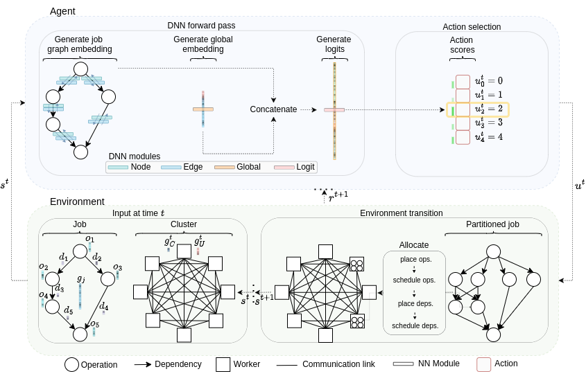

=================================================================
:scissors: Distributed Deep Learning Simulator :desktop_computer:
=================================================================

--------------------------------------------------------------------------------------------------------------------------------------------

Implementation of PAC-ML (partitioning for asynchronous computing with machine
learning) and the associated distributed deep learning simulation of a `RAMP optical architecture <https://arxiv.org/abs/2211.15226>`_ 
as reported in `Partitioning Distributed Compute Jobs with Reinforcement Learning and Graph Neural Networks <https://arxiv.org/abs/2301.13799>`_.

--------------------------------------------------------------------------------------------------------------------------------------------

Setup
=====

Open your command line. Change the current working directory to the location where you want to clone this project, and run::

    $ git clone https://github.com/cwfparsonson/ddls

In the project's root directory, run::

    $ python setup.py install

Then, still in the root directory, install the required packages with conda (env name defined at top of .yaml file)::

    $ conda env create -f requirements/environment.yaml

Overview of this DDLS Library
=============================

'Distributed deep learning' (DDL) is the process of running a deep learning computation graph
across a cluster of machines.

When conducting DDL research, the overall objective is to develop devices, systems, and architectures
which optimise key performance indicators related to the job(s) being processed by the cluster.
Common performance indicators include the job completion time, the blocking rate, and the throughput.

There are two key components of the cluster which determine its performance; (1) the 
end point processors (GPUs, CPUs, etc.), and (2) the communication network connecting them
(made up of fibres and switches).

This library provides the underlying simulation logic to take (1) an arbitrary computation graph defined
as a ``ddls.demands.job.Job`` and (2) a series of resource management actions defined as a
``ddls.environments.ramp_cluster.action.Action``, and run the job on a RAMP optical
cluster. All of the consequences of the computation graph, the cluster's architecture, and
the resource management decisions taken will be evaluated by the underlying simulation logic
of this ``ddls`` library. This enables you as a researcher to focus on developing
more performant resource management strategies, such as the PAC-ML method which we developed,
rather than having to worry about building an entire cluster simulation or accessing
a real production cluster.

Overview of the Core Cluster Simulator
======================================

In the future we would like to extend this library to being able to simulate a variety
of cluster architectures. However, currently ``ddls`` only supports the RAMP optical
architecture. The core code controlling the RAMP simulator is in the ``ddls.environments.ramp_cluster.ramp_cluster_environment.RampClusterEnvironment``
class. Researchers wanting to extend the simulation code to their own non-RAMP cluster
could leave the majority of this code unchanged. Things which would need to be changed
would be (1) the topology (how the end point processors are connected in the communication network),
and (2) the 'rules' which control what is and is not a valid placement in the RAMP cluster environment.

The ``RampClusterEnvironment`` class interfaces like a standard ``gym`` environment,
but does not inherit from ``gym``. This avoids the need to worry about consistently
dimensioned observation and action spaces.

Interacting with the ``RampClusterEnvironment`` is straightforward. At each simulation
step, there will be a job requesting to be placed on the cluster and
there will be a series of jobs already running on the cluster.

When calling ``RampClusterEnvironment.step()``, you must pass a ``ddls.environments.ramp_cluster.actions.action.Action`` object.
Currently, the resource management actions which must be specified are:

- ``ddls.environments.ramp_cluster.actions.op_partition.OpPartition``: How to partition (split up) the operations in the computation graph.
- ``ddls.environments.ramp_cluster.actions.op_placement.OpPlacement``: Which device to place each operation on.
- ``ddls.environments.ramp_cluster.actions.op_schedule.OpSchedule``: In which order to prioritise running operations which are placed on the same machine if they are ready to begin execution at the same time.
- ``ddls.environments.ramp_cluster.actions.dep_placement.DepPlacement``: Which links and channels to place dependencies which require the transfer of data through the communication network.
- ``ddls.environments.ramp_cluster.actions.dep_schedule.DepSchedule``: In which order to prioritise communicating data dependencies which are placed on the same link and channel if they are ready to begin transferring at the same time.

Note that the above actions can be taken by any agent. This could be a heuristic,
such as one of the heuristics available in ``ddls.environments.ramp_cluster.agents`` or your own heuristic,
or a learning agent (see ``ddls.environments.ramp_job_partitioning.ramp_job_partitioning_environment.RampJobPartitioningEnvironment`` and the below 'Using the RAMP Simulator in your Own Code' section).

Various tricks have been used in ``RampClusterEnvironment`` to enable the simulation
to scale to large network sizes without long simulation times. For example, the simulation
internally maintains hash tables to avoid repeating simulation and conflict resolution computation patterns it has already seen.
For a full understanding of how this underlying simulation works, you should read the code in 
``ddls.environments.ramp_cluster.ramp_cluster_environment.RampClusterEnvironment``.

Using the RAMP Simulator in your Own Code
=========================================
This ``ddls`` library and its assoicated cluster simulator have been built to be highly
customisable to many different DDL research projects.

Most DDL research projects focus on a specific part of the cluster, and require a lot of customisation to accommodate for novel ideas. For example,
in the PAC-ML paper, we considered the question of how much to partition computation
jobs, and required the use of a graph neural network, reinforcement learning, our own concept of what an 'action' was, and our own
reward and observation function.

To succinctly frame your own problem without having to worry about all the components
of the ``ddls`` simulation, you can create your own environment which interfaces with
the ``RampClusterEnvironment``.

An example of how you might go about doing this is given in the ``ddls.environments.ramp_job_partitioning.ramp_job_partitioning_environment.RampJobPartitioningEnvironment``
class. Here, we inherit from a ``gym`` environment (as required by many reinforcement learning libraries and applications such as ``rllib``). 
Then, inside ``RampJobPartitioningEnvironment`` we instantiate an instance of the ``RampClusterEnvironment`` cluster. This is what the ``RampJobPartitioningEnvironment``
uses to simulate the whole DDLS cluster without having to implement any of the simulation logic or other resource management heuristics itself.

At each step, the partitioning decisions of the PAC-ML agent are passed to the ``RampJobPartitioningEnvironment``. Inside
``RampJobPartitioningEnvironment.step()``, this action is integrated into a ``ddls.environments.ramp_cluster.actions.action.Action`` object
and passed to the ``RampClusterEnvironment`` object to simulate the agent's chosen actions.

Then, ``RampJobPartitioningEnvironment`` uses its own observation and reward functions to generate an observation
and reward given the ``RampClusterEnvironment`` object.

Note that the concept of an action, observation, and reward are all defined by the
custom ``RampJobPartitioningEnvironment`` class; all the class needs to then do
is integrate the chosen actions into a ``ddls.environments.ramp_cluster.actions.action.Action`` object
and pass it the ``RampClusterEnvironment``. This is powerful because it means that
you as a researcher can define your own custom environment class with your own actions, observations, rewards, and decision-making agent
and still have the ``RampClusterEnvironment`` perform the underlying DDL simulation logic. This makes
the ``ddls`` library compatible with many research projects beyond just what was focused on by PAC-ML.

Below is an example of how you might go about building your own custom environment
with your own framing of actions, rewards, observations, and so on but using the
underlying simulation logic of ``ddls``.

.. code:: python

    from ddls.environments.ramp_cluster.ramp_cluster_environment import RampClusterEnvironment
    from ddls.environments.ramp_cluster.actions.action import Action

    class MyCustomEnvironment:
        def __init__(self, **ramp_cluster_kwargs):
            # Instantiate the RAMP cluster to run the underlying DDL simulation logic
            self.cluster = RampClusterEnvironment(**ramp_cluster_kwargs)

            # **Your own custom initialisation here**

        def reset(self, **ramp_cluster_reset_kwargs):
            # Reset the RAMP cluster N.B. No useful info is returned by RampClusterEnvironment.reset()
            _ = self.cluster.reset(**ramp_cluster_reset_kwargs)

            # **Your own custom reset and observation generation here**

            return obs

        def step(self, action):
            # **Use your custom action to define a RAMP cluster action**
            ramp_action = Action(op_partition=...,
                                 op_placement=...,
                                 op_schedule=...,
                                 dep_placement=...,
                                 dep_schedule=...
                                )

            # Step the RAMP simulator N.B. No useful info is returned by RampClusterEnvironment.step()
            _ = self.cluster.step(ramp_action)

            # **Your own custom step here to extract data from the RAMP cluster as you wish**

            return obs, reward, done, info

Re-Running the Paper's Experiments
==================================
TODO

Citing this work
================
If you find this project or the associated paper useful, please cite our work::

    article{parsonson2023reinforcement,
          title = {Partitioning Distributed Compute Jobs with Reinforcement Learning and Graph Neural Networks},
          author = {Parsonson, Christopher W. F. and Shabka, Zacharaya and Ottino, Alessandro and Zervas, Georgios},
          journal = {arXiv preprint arXiv:2301.13799},
          year = {2023}
        }
